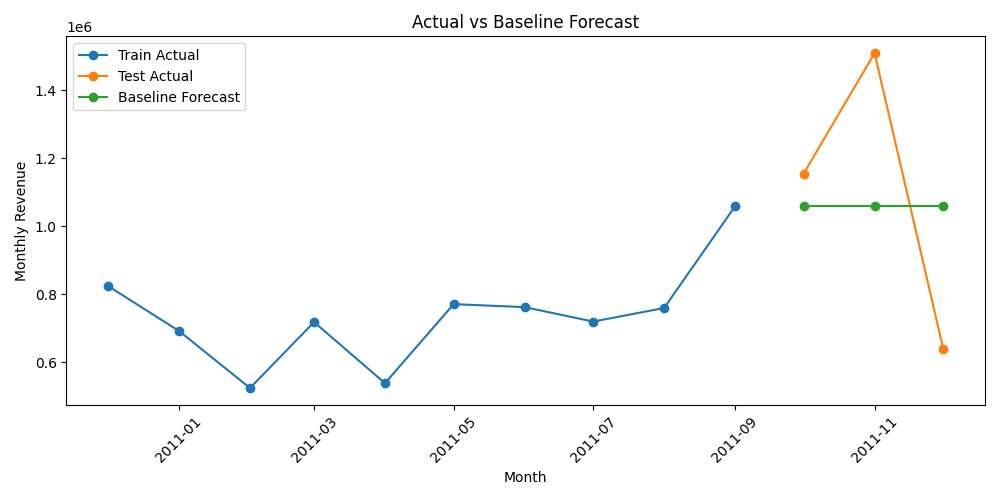
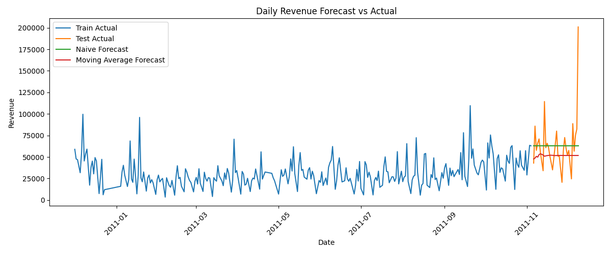
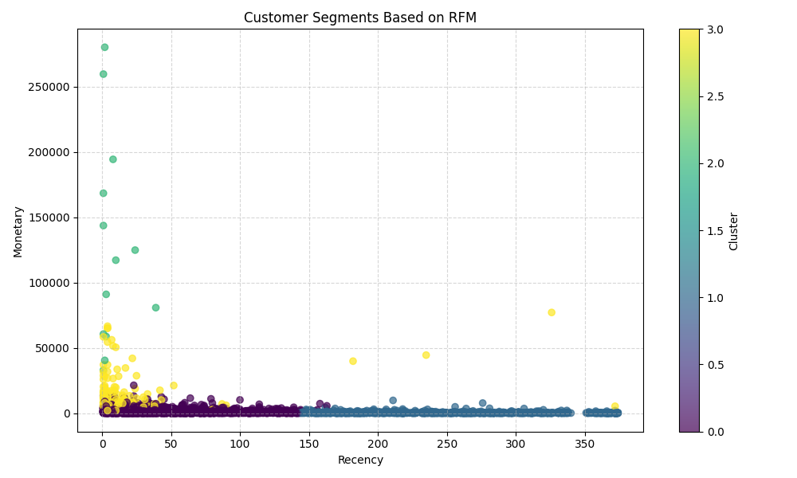

# Online Retail Forecast Pipeline

An end-to-end Python + SQL analytics project built on transaction-level online retail data.

## Project Goal

The goal of this project is to transform raw e-commerce transaction data into reusable analytical datasets and demonstrate practical workflows for:

- data ingestion and preparation
- SQL-based transformation
- time series analysis and forecasting
- customer segmentation using clustering
- model evaluation and visualization

This project combines **Python, SQL, SQLite, time series analysis, and customer analytics** in a reproducible repository structure.

## Quick Navigation

- **Python code:** `src/`
- **SQL scripts:** `sql/`
- **Processed data:** `data/processed/`
- **Forecast outputs and plots:** `outputs/`

## Dataset

This project uses the **Online Retail** dataset containing transaction-level sales records with the following columns:

- InvoiceNo
- StockCode
- Description
- Quantity
- InvoiceDate
- UnitPrice
- CustomerID
- Country

## Main Analytical Modules

### 1. Data Pipeline and SQL Transformation
The project starts from raw Excel transaction data and builds structured analytical datasets using Python and SQL.

Key steps:
- load raw Excel data
- save a reusable CSV copy
- load transaction data into SQLite
- apply SQL-based cleaning rules
- create aggregated monthly sales tables

Relevant files:
- `src/extract.py`
- `sql/01_check_raw_data.sql`
- `sql/02_clean_transactions.sql`
- `sql/03_monthly_aggregation.sql`

### 2. Monthly Forecasting Workflow
A monthly revenue forecasting workflow is built from aggregated transaction data.

Key steps:
- create monthly revenue series
- visualize monthly revenue trends
- split data into train and test sets
- build a baseline naive forecast
- evaluate results with MAE, RMSE, and MAPE

Relevant files:
- `src/features.py`
- `src/train.py`
- `src/evaluate.py`

Main outputs:
- `outputs/monthly_revenue_plot.png`
- `outputs/baseline_predictions.csv`
- `outputs/model_metrics.csv`
- `outputs/forecast_vs_actual.png`

### 3. Customer Segmentation with RFM and Clustering
The repository includes a customer segmentation workflow based on **Recency, Frequency, and Monetary (RFM)** analysis.

Key steps:
- clean customer transaction data
- calculate customer-level RFM metrics
- standardize RFM features
- apply KMeans clustering
- summarize and visualize customer segments

Relevant file:
- `src/segment.py`

Main outputs:
- `outputs/rfm_table.csv`
- `outputs/rfm_clusters.csv`
- `outputs/rfm_cluster_summary.csv`
- `outputs/rfm_cluster_plot.png`

### 4. Daily Time Series Analysis
The project also includes a richer daily time series workflow for trend analysis and forecast comparison.

Key steps:
- aggregate transaction data into daily revenue
- compute a 7-day rolling average
- compare forecasting approaches on a daily time series
- evaluate naive forecast vs 7-day moving average forecast

Relevant file:
- `src/timeseries.py`

Main outputs:
- `outputs/daily_sales.csv`
- `outputs/daily_sales_plot.png`
- `outputs/daily_sales_rolling_plot.png`
- `outputs/timeseries_predictions.csv`
- `outputs/timeseries_model_metrics.csv`
- `outputs/timeseries_forecast_vs_actual.png`

## Example Outputs

### Forecast vs Actual


### Daily Time Series Forecast Comparison


### Customer Segmentation


## Project Structure

```text
online-retail-forecast-pipeline/
├── data/
│   ├── raw/
│   │   └── Online Retail.xlsx
│   ├── processed/
│   │   ├── online_retail.csv
│   │   └── monthly_sales.csv
│   └── retail.db (generated locally, not tracked in Git)
├── outputs/
│   ├── baseline_predictions.csv
│   ├── daily_sales.csv
│   ├── daily_sales_plot.png
│   ├── daily_sales_rolling_plot.png
│   ├── forecast_vs_actual.png
│   ├── model_metrics.csv
│   ├── monthly_revenue_plot.png
│   ├── rfm_cluster_plot.png
│   ├── rfm_cluster_summary.csv
│   ├── rfm_clusters.csv
│   ├── rfm_table.csv
│   ├── timeseries_forecast_vs_actual.png
│   ├── timeseries_model_metrics.csv
│   └── timeseries_predictions.csv
├── sql/
│   ├── 01_check_raw_data.sql
│   ├── 02_clean_transactions.sql
│   └── 03_monthly_aggregation.sql
├── src/
│   ├── evaluate.py
│   ├── extract.py
│   ├── features.py
│   ├── segment.py
│   ├── timeseries.py
│   └── train.py
├── README.md
└── requirements.txt